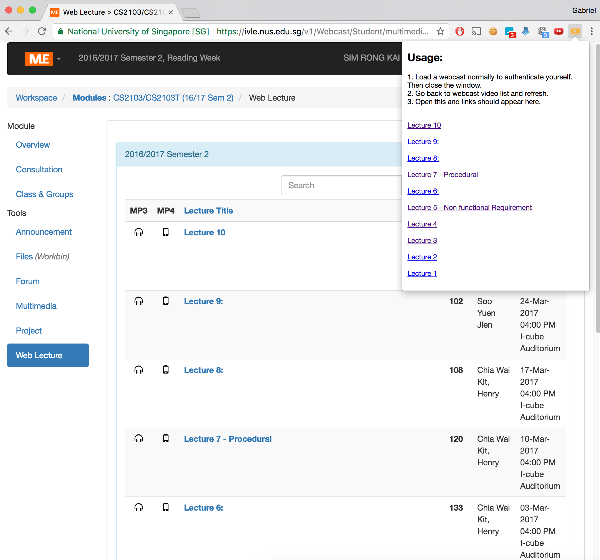

# ivle-webcast-downloader

# Installation
1. Download from the Chrome store (https://chrome.google.com/webstore/detail/ivle-downloader/ekjjmlkgibkbipefpkbaapmhbolebnga)

# Usage
1. Load a webcast normally to authenticate yourself. Then close the window.
2. Go back to webcast video list and refresh.
3. Open extension helper and links should appear here.
